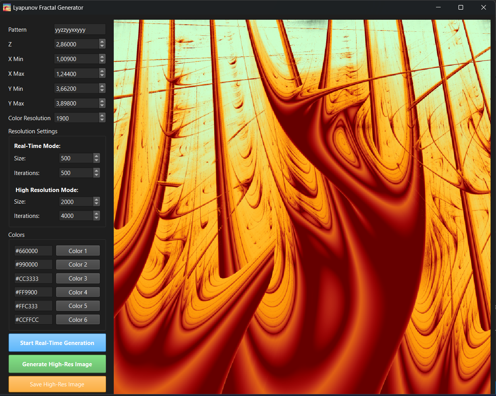

# Lyapunov fractals
This is a simple python project to render lyapunov fractals. It relies on numba cuda kernels for relatively fast fractal generation.


## Requirements

As this project uses numba-cuda, you need a CUDA-enabled NVIDIA graphics card with Compute Capability 3.5 or greater.

## Installation
Optionally, you can create a virtual environement with
```
python -m venv .venv
.venv\Scripts\activate
```

Then run `pip install -r requirements.txt` to install all the necessary packages.

Finally, run `python ./gui.py` to start the user interface.

## Features
### Interactive pyside window

Running the file `gui.py` opens a window where you can modify the fractal parameters:
- Press the `left mouse button` to zoom
- Press the `right mouse button` to dezoom
- Press `space` to increase the $z$ coordinate of the fractal
- Press `backspace` to decrease the $z$ coordinate of the fractal
- Press `c` to cycle the fractal pattern.

### Image generation
Running the file `generate_fractal_image.py` creates an image of a fractal and displays it to the screen.
### Video generation
Running the file `generate_fractal_video.py` creates and stores a gif cycling through slices of a 3D lyapunov fractal in the $z$ direction.

# Details
In the following section we will discuss 2D lyapunov fractals. The generalization to higher dimensions is quite simple as you just need to allow more coordinates in the pattern, and compute the modified logistic sequence values accordingly.

## Theory
A 2D lyapunov fractal is created by computing the _lyapunov exponent_ for each screen pixel of a modified logistic sequence.

### Modified Logistic sequences 
We call _pattern_ a chain of "x" and "y" characters, such as "xyyyxyxx".

Given a pattern and a value for $x$ and $y$, we define a sequence $f^N(v_0)$ as 
$$f^{N+1}(v_0) = r_{x, y}(N) \cdot  f^N(v_0) \cdot (1 - f^N(v_0))$$
where $r_{x, y}(N) = \text{pattern}[N \\; \\;\text{mod} \\; \text{length(pattern)}]$

### Fractal algorithm

We first associate the pixels of the screen to a grid of coordinates between 0 and 4 (this is the range on which the logistic sequence is stable).

Then for each pixel on the screen:
1. Get the $x$ and $y$ coordinates corresponding to the pixel position.
2. Compute the lyapunov exponent of the sequence $(f^N(0.5))$
3. Then, color the pixel according to the value of the lyapunov exponent.

Interestingly, the diagonal $x = y$ of any 2D lyapunov fractal is always the same, as the pattern doesn't influence the sequence. The color of this diagonal is given by the lyapunov exponents of the logistic sequence for values of $r$ going from 0 to 4.

### The lyapunov exponent
Let $(f^N(v_0))_{N \in \mathbb{N}}$ be a sequence defined recursively by

$$f^{N}(v_0)=\begin{cases}
v_0 \quad \text{if } N=0\\
f(f^{N-1}(v_0)) \quad \text{if } N > 0
\end{cases}$$

The lyapunov exponent $\lambda$ is a measure of how quickly an infinitesimal change in initial condition $v_0$ evolves over time. So for large $N$ and small $\epsilon$:

$|f^N(v_0) - f^N(v_0 + \epsilon)| \approx \epsilon e^{\lambda N}$

Here we assume that the distance is an exponential function of time.
To compute $\lambda$, we write:

$$\begin{align*}\lambda &\approx \lim\_{\epsilon \to 0, N \to +\infty}\frac{1}{N}\ln(\frac{|f^N(v\_0) - f^N(v\_0 + \epsilon)|}{\epsilon})\\
&\approx \lim\_{N \to +\infty}\frac{1}{N}\ln|\frac{df^N}{dx}|\_{v\_0}\\
&\approx \lim\_{N \to +\infty}\frac{1}{N}\ln\left[|\frac{df}{dx}|\_{f^{N-1}(v\_0)} \cdot |\frac{df^{N-1}}{dx}|\_{f^{N-2}(v\_0)} \right]\\
&\approx \lim\_{N \to +\infty}\frac{1}{N}\ln\left[|\frac{df}{dx}|\_{f^{N-1}(v\_0)} \cdot |\frac{df}{dx}|\_{f^{N-2}(v\_0)} \dots |\frac{df}{dx}|\_{v\_0} \right]\\
&\approx \lim\_{N \to +\infty}\frac{1}{N} \sum\_{n=1}^{N-1}\ln|\frac{df}{dx}|\_{f^{n}(v\_0)}\end{align*}$$

We can therefore approximate $\lambda$ by truncating the series at large $N$. In our case, $f_r(x) = rx(1-x)$ so $\frac{df}{dx} = r(1-2x)$. Moreover, as we color our pixels by comparing the $\lambda$ values at each pixel, the constant factor $\frac{1}{N}$ does not change the resulting image. We can therefore discard it and write:

$$\lambda'\_N = \sum_{n=1}^{N}\ln|r\_n(1-2f^{n}(v\_0))|$$

Here is the kernel that runs for each image pixel
```python
for i in range(num_iter):
    r = (x, y, z)[sequence[i%len_sequence]]
    x_n = r*x_n*(1-x_n)
    lambda_N += log(abs(r*(1-2*x_n)))
x_space[pos] = lambda_N
```

## Implementation
You can set the fractal parameters of `ComputeFractals` using the `set_parameters` method, which can take in any combination of:
- `x_min`, `x_max`, `y_min`, `y_max`, `z` define the region in which fractals will be computed. These values need to be between 0 and 4.
- `size`: the size of the generated images in pixels.
- `colors`: a list of hex colors such as "#ff0ed6".
- `color_resolution`: how many different shades of the color list are used.
- `pattern`: a string of "x", "y", and "z". The pattern defines which fractal is generated.
- `num_iter`: defines at which precision the pixel values are computed.

Calling `compute_fractal()` then computes a slice of a 3D lyapunov fractal using the current parameters.
`apply_gradient()` then applies a color gradient and returns an image.
